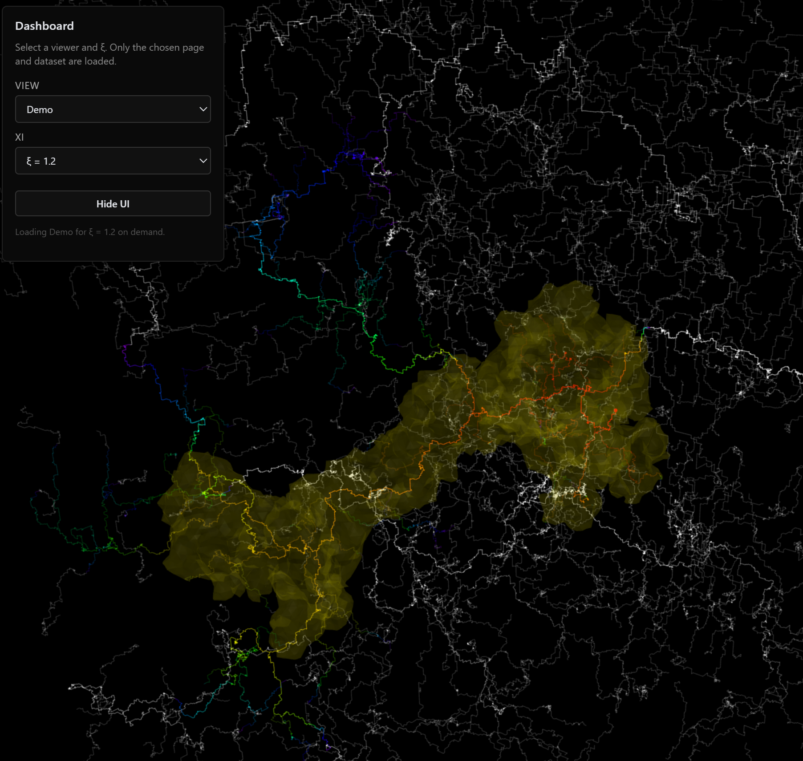
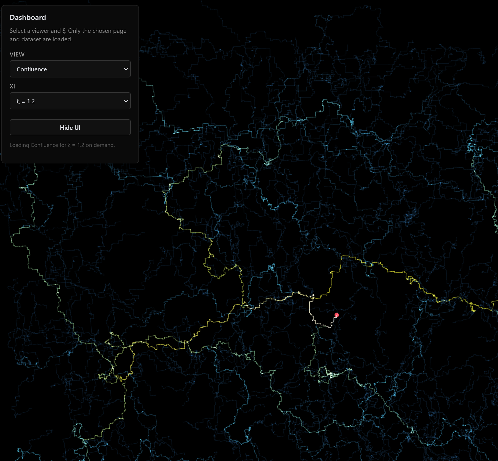

# RandomFieldGeometry.jl

`RandomFieldGeometry.jl` is a Julia package for generating random fields such as Gaussian free fields and log-correlated random fields, studying random geometry and related metric structures, and exporting or visualizing the resulting objects.

[](https://aub.ie/lfpp3d)

<p align="center">
  <a href="https://aub.ie/lfpp3d">
    
  </a>
</p>

At present, the main implemented workflow focuses on first-passage percolation (FPP) geodesics for exponentials of log-correlated random fields in 2D and 3D, with the 2D case closely related to Liouville quantum gravity (LQG) metrics. The public interface is centered around:

- `run_lfpp_simulation` for data generation,
- `export_vtk` for ParaView / VTK export,
- and a minimal GLMakie viewer through `interactive_viewer`.

The repository is organized as a standard Julia package:

- `src/RandomFieldGeometry.jl` is the package entry point.
- `src/RandomFieldGenerators.jl` contains optimized random field generators with Dirichlet boundary conditions.
- `src/Pathfinders.jl` contains the current shortest-path solver, with optional GPU backends via CUDA and Metal.
- `examples/` contains runnable example scripts.
- `test/` contains a basic regression suite.

The codebase is designed with scale and performance in mind. As one reference point for the current LFPP workflow, on my local machine with an NVIDIA RTX 3090 Ti using CUDA, computing geodesics in a `1024^3` box from `256` sampled starting points takes under `2` minutes.

## Simulation Highlight: Confluence in 3D

[](https://aub.ie/confluence3d)

<p align="center">
  <a href="https://aub.ie/confluence3d">
    
  </a>
</p>

One striking feature suggested by these simulations is geodesic confluence in 3D, and possibly in higher dimensions, for LFPP-type metric geometries. To the best of my knowledge, this phenomenon has not yet been explicitly conjectured in the literature in this form, so the confluence demo is intended as visual evidence and motivation for further investigation.

## Citation

If you use `RandomFieldGeometry.jl` in research or course materials, please cite the repository directly until a formal paper is available:

> Park, M. (2026). *RandomFieldGeometry.jl: A Julia package for random-field geometry and visualization*. GitHub repository.

```bibtex
@misc{Park_RandomFieldGeometry_2026,
  author = {Park, Minjae},
  title = {RandomFieldGeometry.jl: A Julia package for random-field geometry and visualization},
  year = {2026},
  publisher = {GitHub},
  journal = {GitHub repository}
}
```

## Future Implementations

- Imaginary geometry and its SLE-like flow lines
- Geometry of Gaussian free field in 2D and 3D, including percolation
- Square subdivision models
- Random field generators for other models or boundary conditions
- Other conformal random geometry in 2D and 3D

**Feature Requests & Collaboration:**
I am very open to implementing additional models and related geometry workflows. Please feel free to [reach out via email](mailto:minjaep@auburn.edu) for feature requests, questions, or research collaboration.

## Installation

To install from GitHub:

```julia
using Pkg
Pkg.add(url="https://github.com/MinjaePark-Math/RandomFieldGeometry.jl")
```

## Optional GLMakie Viewer

The core package does not require Makie. The minimal interactive viewer is loaded through a Julia package extension when these optional packages are available in the current environment:

```julia
using Pkg
Pkg.add(["Colors", "GeometryBasics", "GLMakie"])
```

Load them in the same Julia session before calling `interactive_viewer`.

## Quick start

For a basic 3D LFPP simulation and VTK export:

```julia
using RandomFieldGeometry

sim = run_lfpp_simulation(128, 1.0f0; dim=3)
export_vtk(sim.distances, "vtk_results/example"; path_step=8)
```

For a 2D Makie viewer:

```julia
using Colors
using GeometryBasics
using GLMakie
using RandomFieldGeometry

sim = run_lfpp_simulation(128, 0.8f0; dim=2)
interactive_viewer(sim.distances; path_step=8)
```

The scripts in [examples](examples/) provide minimal entry points for Makie viewing and ParaView export.
